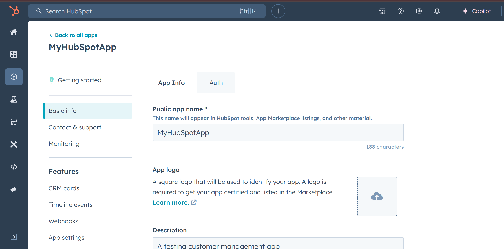

# Ballerina Ballerina HubSpot CRM Lineitems Connector connector

[](https://github.com/ballerina-platform/module-ballerinax-hubspot.crm.object.lineitems/actions/workflows/ci.yml)
[](https://github.com/ballerina-platform/module-ballerinax-hubspot.crm.object.lineitems/actions/workflows/trivy-scan.yml)
[](https://github.com/ballerina-platform/module-ballerinax-hubspot.crm.object.lineitems/actions/workflows/build-with-bal-test-graalvm.yml)
[](https://github.com/ballerina-platform/module-ballerinax-hubspot.crm.object.lineitems/commits/master)
[](https://github.com/ballerina-platform/ballerina-library/labels/module%hubspot.crm.object.lineitems)

# Overview

[//]: # (TODO: Add overview mentioning the purpose of the module, supported REST API versions, and other high-level details.)
[HubSpot](https://www.hubspot.com/our-story) is  a comprehensive inbound marketing, sales, and customer service platform that provides tools for CRM, content management, email marketing and analytics. It empowers businesses to grow and engage with customers more effectively.

The `ballerinax-hubspot.crm.object.lineitems` [module](https://developers.hubspot.com/docs/guides/api/crm/objects/line-items)  is designed for the developers to use the line items API to add instances of products to deals and quotes. Clients can create line items from existing products or create them as custom line items with no product attached. This allows clients to connect and interact with [HubSpot API](https://developers.hubspot.com/docs/reference/api/overview) endpoints, specifically based on [HubSpot API v3](https://developers.hubspot.com/changelog/crm-api-v3-is-generally-available).


# Setup guide

[//]: # (TODO: Add detailed steps to obtain credentials and configure the module.)

You need a [HubSpot developer account](https://developers.hubspot.com/get-started) with an [app](https://developers.hubspot.com/docs/guides/apps/public-apps/overview) to use HubSpot connectors.
To obtain an authentication token for your HubSpot developer account, you can use OAuth for public apps. 

Below is a step-by-step guide for both methods:

### Using OAuth for Public Apps:

### `Step 01` Create Developer Account
* If you don't have a developer account, register for a free Hubspot developer account.[click here](https://app.hubspot.com/signup-hubspot/developers?_ga=2.207749649.2047916093.1734412948-232493525.1734412948&step=landing_page)

### `Step 02` Create a [Developer test account](https://developers.hubspot.com/beta-docs/getting-started/account-types#developer-test-accounts):

### `Step 03` Create a HubSpot App:

  * In your developer account, navigate to the [Apps](https://app.hubspot.com/developer/48567544/applications) section.
Click on `Create App` and provide the necessary details, including the app name and description.

### `Step 04` Initiate the OAuth Flow:

* Move to the auth tab in the created app and set the permissions there 

*  This direct users to HubSpot's authorisation URL with the following query parameters:

`client_id`: Your app's Client ID.

`redirect_uri`: The URL users will be redirected to after granting access.

`scope`: A space-separated list of scopes your app is requesting.


### `Step 05` Scope selection: 

* Go to the [crm.objects.line-items API reference](https://developers.hubspot.com/docs/reference/api/crm/objects/line-items) and there you will see the scope has defined below way

* Now come back to your Auth page and add the relevant scopes using the `Add new scope` button 

### `Step 06` Add redirect URL to `localhost:9090`

### `Step 07` Activate Ballerina service

* Use the following ballerina code and run it locally on your computer using `bal run` to activate the service. [Code](https://gist.github.com/lnash94/0af47bfcb7cc1e3d59e06364b3c86b59)

``` bash
import ballerina/http;
import ballerina/io;


service / on new http:Listener(9090) {
   resource function get .(http:Caller caller, http:Request req) returns error? {
       // Extract the "code" query parameter from the URL
       string? code = req.getQueryParamValue("code");


       if code is string {
           // Log the received code
           io:println("Authorization code received: " + code);
           // Respond to the client with the received code
           check caller->respond("Received code: " + code);
       } else {
           // Respond with an error message if no code is found
           check caller->respond("Authorization code not found.");
       }
   }
}


```

### `Step 08` Copy the sample installation URL and paste it on a web browser. 

* Browser pop the HubSpost account and ask where to install the App then select your developer test account 
* You will receive a code from there and it will be displayed on the browser

### `Step 09` Place ur code, client_id and client_screct  in to the correct place here,
``` bash
curl --request POST \
  --url https://api.hubapi.com/oauth/v1/token \
  --header 'content-type: application/x-www-form-urlencoded' \
  --data 'grant_type=authorization_code&code=<code>&redirect_uri=http://localhost:9090&client_id=<client_id>&client_secret=<client_secret>'
```
* Then execute this in terminal. If successful, you'll receive a JSON response containing `access_token` and `refresh_token`.


## Configure the module

1. Create `Config.toml` file under ballerina/tests directory and add your credentials there


# Quickstart

[//]: # (TODO: Add a quickstart guide to demonstrate a basic functionality of the module, including sample code snippets.)

# Examples

The `Ballerina HubSpot CRM Lineitems Connector` connector provides practical examples illustrating usage in various scenarios. Explore these [examples](https://github.com/module-ballerinax-hubspot.crm.object.lineitems/tree/main/examples/), covering the following use cases:

[//]: # (TODO: Add examples)

# Build from the source

### Setting up the prerequisites

1. Download and install Java SE Development Kit (JDK) version 21. You can download it from either of the following sources:

    * [Oracle JDK](https://www.oracle.com/java/technologies/downloads/)
    * [OpenJDK](https://adoptium.net/)

   > **Note:** After installation, remember to set the `JAVA_HOME` environment variable to the directory where JDK was installed.

2. Download and install [Ballerina Swan Lake](https://ballerina.io/).

3. Download and install [Docker](https://www.docker.com/get-started).

   > **Note**: Ensure that the Docker daemon is running before executing any tests.

4. Export Github Personal access token with read package permissions as follows,

    ```bash
    export packageUser=<Username>
    export packagePAT=<Personal access token>
    ```

### Build options

Execute the commands below to build from the source.

1. To build the package:

   ```bash
   ./gradlew clean build
   ```

2. To run the tests:

   ```bash
   ./gradlew clean test
   ```

3. To build the without the tests:

   ```bash
   ./gradlew clean build -x test
   ```

4. To run tests against different environments:

   ```bash
   ./gradlew clean test -Pgroups=<Comma separated groups/test cases>
   ```

5. To debug the package with a remote debugger:

   ```bash
   ./gradlew clean build -Pdebug=<port>
   ```

6. To debug with the Ballerina language:

   ```bash
   ./gradlew clean build -PbalJavaDebug=<port>
   ```

7. Publish the generated artifacts to the local Ballerina Central repository:

    ```bash
    ./gradlew clean build -PpublishToLocalCentral=true
    ```

8. Publish the generated artifacts to the Ballerina Central repository:

   ```bash
   ./gradlew clean build -PpublishToCentral=true
   ```

## Contribute to Ballerina

As an open-source project, Ballerina welcomes contributions from the community.

For more information, go to the [contribution guidelines](https://github.com/ballerina-platform/ballerina-lang/blob/master/CONTRIBUTING.md).

## Code of conduct

All the contributors are encouraged to read the [Ballerina Code of Conduct](https://ballerina.io/code-of-conduct).

## Useful links

* For more information go to the [`hubspot.crm.object.lineitems` package](https://central.ballerina.io/ballerinax/hubspot.crm.object.lineitems/latest).
* For example demonstrations of the usage, go to [Ballerina By Examples](https://ballerina.io/learn/by-example/).
* Chat live with us via our [Discord server](https://discord.gg/ballerinalang).
* Post all technical questions on Stack Overflow with the [#ballerina](https://stackoverflow.com/questions/tagged/ballerina) tag.
