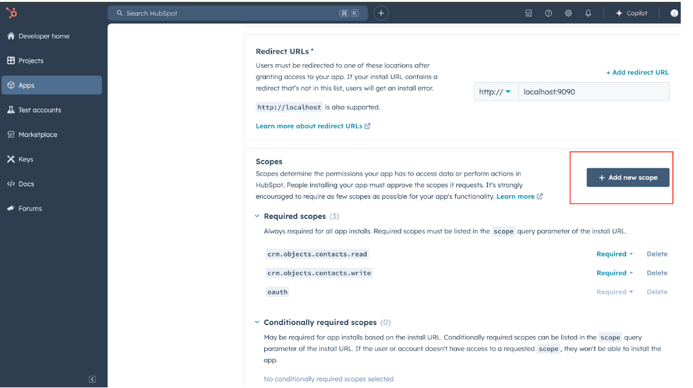

# Overview

[HubSpot](https://www.hubspot.com/our-story) is an AI-powered customer relationship management (CRM) platform. 

The `ballerinax/hubspot.crm.object.lineitems`  offers APIs to connect and interact with the [HubSpot API V3](https://developers.hubspot.com/docs/reference/api/overview) endpoints, specifically based on the [API Docs](https://developers.hubspot.com/docs/guides/api/crm/objects/line-items).

# Setup guide


You need a [HubSpot developer account](https://developers.hubspot.com/get-started) with an [app](https://developers.hubspot.com/docs/guides/apps/public-apps/overview) to use HubSpot connectors.
To obtain an authentication token for your HubSpot developer account, you can use OAuth for public apps. 

Below is a step-by-step guide for both methods:

### Using OAuth for Public Apps:

#### Step 01 : Create Developer Account
* If you have an account already go to the [Hubspot account portal](https://app.hubspot.com/myaccounts-beta)
* If you don't have a developer account, register for a free Hubspot developer account.[(click here)](https://app.hubspot.com/signup-hubspot/developers?_ga=2.207749649.2047916093.1734412948-232493525.1734412948&step=landing_page)

#### Step 02 : Create a [Developer test account](https://developers.hubspot.com/beta-docs/getting-started/account-types#developer-test-accounts):
Within app developer accounts, you can create developer test accounts to test apps and integrations without affecting any real HubSpot data.

Note: These accounts are only for development and testing purposes. In production you should not use Developer Test Accounts.

1. Go to Test Account section from the left sidebar.

   


2. Click Create developer test account.

   

3. Create developer test account by providing a name

#### Step 03 : Create a HubSpot App:

  * In your developer account, navigate to the [Apps](https://app.hubspot.com/developer/48567544/applications) section.
Click on `Create App` and provide the necessary details, including the app name and description to create a Hubspot developer App.


#### Step 04 : Initiate the OAuth Flow:

* Move to the auth tab in the created app and set the permissions there 

*  This direct users to HubSpot's authorisation URL with the following query parameters:

`client_id`: Your app's Client ID.

`redirect_uri`: The URL users will be redirected to after granting access.

`scope`: A space-separated list of scopes your app is requesting.


#### Step 05: Scope selection: 

* Go to the [crm.objects.line-items API reference](https://developers.hubspot.com/docs/reference/api/crm/objects/line-items) and there you will see the scope has defined below way

* Now come back to your Auth page and add the relevant scopes using the `Add new scope` button 

#### Step 06: Add redirect URL
Add your Redirect URL in the relevant section. You can also use `localhost` addresses for localhost development purposes. 

#### Step 07 (For localhost redirect url): Activate ballerina service
* If you are using a 'localhost' redirect url, make sure to have a listener running at the relevant port before executing the next step.
* Use the following ballerina code and run it locally on your computer using `bal run` to activate the service. 

``` bash
import ballerina/http;
import ballerina/io;


service / on new http:Listener(9090) {
   resource function get .(http:Caller caller, http:Request req) returns error? {
       // Extract the "code" query parameter from the URL
       string? code = req.getQueryParamValue("code");


       if code is string {
           // Log the received code
           io:println("Authorization code received: " + code);
           // Respond to the client with the received code
           check caller->respond("Received code: " + code);
       } else {
           // Respond with an error message if no code is found
           check caller->respond("Authorization code not found.");
       }
   }
}
```

#### Step 08: Copy the sample installation URL and paste it on a web browser. 

* Browser pop the HubSpost account and ask where to install the App then select your developer test account 
* You will receive a code from there and it will be displayed on the browser


#### Step 09: Get the Refresh & Access tokens
Run the following curl command. Replace the `<YOUR_CLIENT_ID>`, `<YOUR_REDIRECT_URI`> and `<YOUR_CLIENT_SECRET>` with your specific value. Use the code you received in the above step 8 as the `<CODE>`.

``` bash
curl --request POST \
  --url https://api.hubapi.com/oauth/v1/token \
  --header 'content-type: application/x-www-form-urlencoded' \
  --data 'grant_type=authorization_code&code=<code>&redirect_uri=http://localhost:9090&client_id=<client_id>&client_secret=<client_secret>'
```
* Then execute this in terminal. This command will return the access token necessary for API calls.

   ```json
   {
     "token_type": "bearer",
     "refresh_token": "<Refresh Token>",
     "access_token": "<Access Token>",
     "expires_in": 1800
   }
   ```

Store the access token securely for use in your application.


# Quickstart

To use the `HubSpot CRM Object Line items` connector in your Ballerina application, update the `.bal` file as follows:

#### Step 1: Import the module

Import the `hubspot.crm.object.lineitems` module and `oauth2` module.

```ballerina
import ballerinax/hubspot.crm.object.lineitems as hslineitems;
import ballerina/oauth2;
```

#### Step 2: Instantiate a new connector

1. Create a `Config.toml` file and, configure the obtained credentials obtained in the above steps as follows:

   ```toml
    clientId = <Client Id>
    clientSecret = <Client Secret>
    refreshToken = <Refresh Token>
   ```

2. Instantiate a `OAuth2RefreshTokenGrantConfig` with the obtained credentials and initialize the connector with it.

    ```ballerina
   configurable string clientId = ?;
   configurable string clientSecret = ?;
   configurable string refreshToken = ?;

   OAuth2RefreshTokenGrantConfig auth = {
      clientId,
      clientSecret,
      refreshToken,
      credentialBearer: oauth2:POST_BODY_BEARER 
   };

   ConnectionConfig config = {auth};
   final Client HubSpotClient = check new Client(config, "https://api.hubapi.com");
   ```

#### Step 3: Invoke the connector operation

Now, utilize the available connector operations. A sample usecase is shown below.

#### Create a New Line item

```bash
public function main() returns error? {
    SimplePublicObjectInputForCreate payload = {

    "associations": [
    {
        "types": [
        {
          "associationCategory": "HUBSPOT_DEFINED",
          "associationTypeId": 20
        }
      ],
      "to": {
        "id": "31232284502"
      }
      
    }
  ],"objectWriteTraceId": "2",
  "properties": {
    "price": "400.00",
    "quantity": "10",
    "name": "Item 6"
  }
  
};
    SimplePublicObject response = check HubSpotClient->/crm/v3/objects/line_items.post(payload);
    io:println(response);
    return;
}
```

# Examples

The `Ballerina HubSpot CRM Lineitems Connector` connector provides practical examples illustrating usage in various scenarios. Explore these [examples](https://github.com/module-ballerinax-hubspot.crm.object.lineitems/tree/main/examples/), covering the following use cases:

[//]: # (TODO: Add examples)
